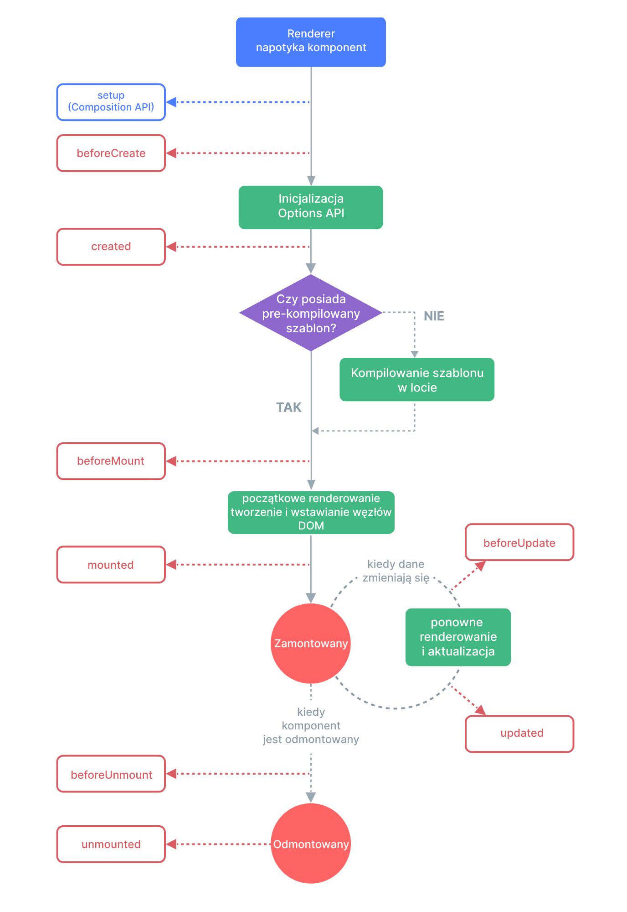

# Haki cyklu życia {#lifecycle-hooks}

Każda instancja komponentu Vue przechodzi przez serię etapów inicjalizacji podczas jej tworzenia – na przykład musi ustawić obserwację danych, skompilować szablon, zamontować instancję w DOM i aktualizować DOM, gdy dane ulegną zmianie. W trakcie tego procesu uruchamiane są również funkcje zwane hakami cyklu życia (lifecycle hooks), które dają użytkownikom możliwość dodania własnego kodu na określonych etapach.

## Rejestrowanie haków cyklu życia {#registering-lifecycle-hooks}

Na przykład hak <span class="composition-api">`onMounted`</span><span class="options-api">`mounted`</span> może być użyty do uruchomienia kodu po zakończeniu początkowego renderowania i utworzeniu węzłów (nodes) DOM:

<div class="composition-api">

```vue
<script setup>
import { onMounted } from 'vue'

onMounted(() => {
  console.log(`komponent został zamontowany.`)
})
</script>
```

</div>
<div class="options-api">

```js
export default {
  mounted() {
    console.log(`komponent został zamontowany.`)
  }
}
```

</div>

Istnieją również inne haki, które są wywoływane na różnych etapach cyklu życia instancji, najczęściej używane to <span class="composition-api">[`onMounted`](/api/composition-api-lifecycle#onmounted), [`onUpdated`](/api/composition-api-lifecycle#onupdated), i [`onUnmounted`](/api/composition-api-lifecycle#onunmounted).</span><span class="options-api">[`mounted`](/api/options-lifecycle#mounted), [`updated`](/api/options-lifecycle#updated), i [`unmounted`](/api/options-lifecycle#unmounted).</span>

<div class="options-api">

Wszystkie haki cyklu życia są wywoływane z kontekstem `this` wskazującym na aktualnie aktywną instancję komponentu. Oznacza to, że należy unikać używania funkcji strzałkowych przy deklarowaniu haków cyklu życia, ponieważ nie będzie można uzyskać dostępu do instancji komponentu za pomocą `this`.

</div>

<div class="composition-api">

When calling `onMounted`, Vue automatically associates the registered callback function with the current active component instance. This requires these hooks to be registered **synchronously** during component setup. For example, do not do this:

Podczas wywoływania `onMounted` Vue automatycznie kojarzy zarejestrowaną funkcję zwrotną z aktualnie aktywną instancją komponentu. Wymaga to, aby te haki były rejestrowane **synchronicznie** podczas konfiguracji komponentu. Na przykład, nie rób tego:

```js
setTimeout(() => {
  onMounted(() => {
    // to nie zadziała.
  })
}, 100)
```

Należy pamiętać, że nie oznacza to, że wywołanie musi zostać umieszczone leksykalnie wewnątrz `setup()` lub `<script setup>`. `onMounted()` można wywołać w funkcji zewnętrznej, pod warunkiem, że stos wywołań jest synchroniczny i pochodzi z `setup()`.

</div>

## Diagram cyklu życia {#lifecycle-diagram}

Poniżej znajduje się diagram przedstawiający cykl życia instancji. Nie musisz od razu w pełni rozumieć wszystkich szczegółów, ale w miarę nauki i tworzenia kolejnych komponentów może to okazać się przydatnym odniesieniem.



<!-- https://www.figma.com/file/Xw3UeNMOralY6NV7gSjWdS/Vue-Lifecycle -->

Aby uzyskać szczegółowe informacje na temat wszystkich haków cyklu życia i ich przypadków użycia, zapoznaj się z <span class="composition-api">[API haków cyklu życia](/api/composition-api-lifecycle)</span><span class="options-api">[API haków cyklu życia](/api/options-lifecycle)</span>.
