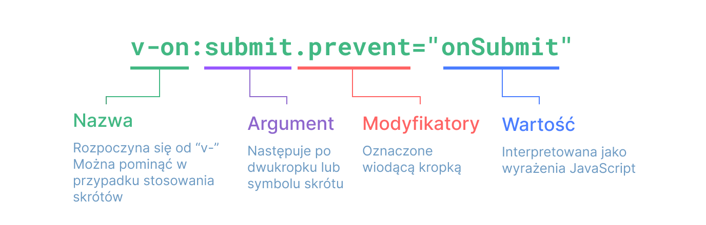

# Składnia szablonów {#template-syntax}

Vue używa składni szablonów opartej na HTML, która pozwala deklaratywnie powiązać renderowany DOM z danymi w instancji komponentu. Wszystkie szablony Vue są składniowo poprawnym HTML, który może być parsowany przez zgodne z przepisami przeglądarki i analizatory HTML.

"Pod spodem" Vue kompiluje szablony do wysoko zoptymalizowanego kodu JavaScript. W połączeniu z systemem reaktywności Vue inteligentnie określa minimalną liczbę komponentów do ponownego renderowania i stosuje minimalne manipulacje DOM przy zmianie stanu aplikacji.

Jeśli znasz koncepcję Wirtualnego DOM-u i preferujesz czystą moc JavaScriptu, możesz także [bezpośrednio pisać funkcje renderujące](/guide/extras/render-function), zamiast szablonów, z opcjonalnym wsparciem JSX. Jednak nie będą one cieszyć się tym samym poziomem optymalizacji w czasie kompilacji, co szablony.

## Interpolacja tekstu {#text-interpolation}

Najprostszą formą wiązania danych jest interpolacja tekstu przy użyciu składni „wąsy” (podwójne nawiasy klamrowe):

```vue-html
<span>Wiadomość: {{ msg }}</span>
```

Znacznik podwójnych nawiasów klamrowych zostanie zastąpiony wartością właściwości `msg`[z odpowiadającego komponentu](/guide/essentials/reactivity-fundamentals#declaring-reactive-state). Wartość ta zostanie zaktualizowana za każdym razem, gdy właściwość `msg` się zmieni.

## Surowy HTML {#raw-html}

The double mustaches interpret the data as plain text, not HTML. In order to output real HTML, you will need to use the [`v-html` directive](/api/built-in-directives#v-html):
Podwójne nawiasy klamrowe interpretują dane jako zwykły tekst, a nie HTML. Aby wyrenderować rzeczywisty HTML, użyj dyrektywy [`v-html`](/api/built-in-directives#v-html):

```vue-html
<p>Używanie interpolacji tekstu: {{ rawHtml }}</p>
<p>Używanie dyrektywy v-html: <span v-html="rawHtml"></span></p>
```

<script setup>
  const rawHtml = '<span style="color: red">To powinno być czerwone.</span>'
</script>

<div class="demo">
  <p>Używanie interpolacji tekstu: {{ rawHtml }}</p>
  <p>Używanie dyrektywy v-html: <span v-html="rawHtml"></span></p>
</div>

Tutaj napotykamy coś nowego. Atrybut `v-html`, który widzisz jest nazywany **dyrektywą**. Dyrektywy mają przedrostek `v-`, aby wskazać, że są to specjalne atrybuty dostarczane przez Vue i jak możesz się domyślić, stosują specjalne reaktywne zachowanie do renderowanego DOM-u. Tutaj zasadniczo mówimy "utrzymój wewnętrzny kod HTML tego elementu na bieżąco z właściwością `rawHtml` w bieżącej aktywnej instancji".

Zawartość elementu `span` zostanie zastąpiona wartością atrybutu `rawHtml`, interpretowanego jako czysty HTML - powiązania danych są ignorowane. Należy pamiętać, że nie można używać `v-html`do komponowania części szablonów, ponieważ Vue nie jest silnikiem szablonów opartym na ciągach znaków. Zamiast tego komponenty są preferowane jako podstawowa jednostka do ponownego używania w interfejsie użytkownika i kompozycji.

:::warning Ostrzeżenie dotyczące bezpieczeństwa
Dynamiczne renderowanie dowolnego HTML-a może prowadzić do [luk XSS](https://en.wikipedia.org/wiki/Cross-site_scripting). Używaj `v-html` tylko z zaufaną zawartością i **nigdy** z danymi dostarczonymi przez użytkownika. :::

## Wiązanie atrybutów {#attribute-bindings}

Nawiasy klamrowe nie mogą być używane w atrybutach HTML. Zamiast tego użyj [dyrektywy v-bind](/api/built-in-directives#v-bind):

```vue-html
<div v-bind:id="dynamicId"></div>
```

Dyrektywa `v-bind` instruuje Vue, aby synchronizowało atrybut `id` elementu z właściwością `dynamicId` komponentu. Jeśli wartość powiązana jest równa `null` lub `undefined`, atrybut zostanie usunięt z renderowanego elementu.

### Skrócona składnia {#shorthand}

Ponieważ `v-bind` jest często używane, ma specjalną skróconą składnię:

```vue-html
<div :id="dynamicId"></div>
```

Atrybuty zaczynające się od `:` mogą wyglądać nieco inaczej niż standardowe atrybuty HTML, ale w rzeczywistości są poprawne i wszystkie przeglądarki obsługiwane przez Vue potrafią je poprawnie parsować. Dodatkowo nie pojawiają się one w końcowym wyrenderowanym kodzie HTML. Skrócona składnia jest opcjonalna, ale prawdopodobnie docenisz jej wygodę, gdy poznasz jej dalsze zastosowania.

> W dalszej części przewodnika będziemy używać skróconej składni w przykładach kodu, ponieważ jest to najczęstszy sposób korzystania z Vue.

### Skrócona składnia dla atrybutów o tej samej nazwie <sup class="vt-badge" data-text="3.4+" /> {#same-name-shorthand}

Jeśli atrybut ma tę samą nazwę co wartość JavaScript, do której jest przypisany, składnię można dodatkowo skrócić, pomijając wartość atrybutu:

```vue-html
<!-- to samo co :id="id" -->
<div :id></div>

<!-- to również działą -->
<div v-bind:id></div>
```

Jest to podobne do skróconej składni dla właściwości w obiektach JavaScript. Należy zauważyć, że ta funkcja jest dostępna wyłącznie w Vue 3.4 i nowszych wersjach.

### Atrybuty logiczne (atrybuty boolean) {#boolean-attributes}

[Atrybuty logiczne](https://html.spec.whatwg.org/multipage/common-microsyntaxes.html#boolean-attributes) to atrybuty, które mogą oznaczać wartości true / false poprzez swoją obecność w elemencie. Na przykład [`disabled`](https://developer.mozilla.org/en-US/docs/Web/HTML/Attributes/disabled) jest jednym z najczęściej używanych atrybutów logicznych.

`v-bind` działa to nieco inaczej:

```vue-html
<button :disabled="isButtonDisabled">Przycisk</button>
```

Atrybut `disabled` zostanie dodany, jeśli `isButtonDisabled` ma wartość [wartość truthy](https://developer.mozilla.org/en-US/docs/Glossary/Truthy). Zostanie on również dodany, jeśli wartość to pusty ciąg znaków, co jest zgodne z `<button disabled="">`. Dla innych [wartości falsy](https://developer.mozilla.org/en-US/docs/Glossary/Falsy) atrybut zostanie pominięty.

### Dynamiczne przypisywanie wielu atrybutów {#dynamically-binding-multiple-attributes}

Jeśli masz obiekt JavaScript reprezentujący wiele atrybutów, wyglądający tak:

<div class="composition-api">

```js
const objectOfAttrs = {
  id: 'container',
  class: 'wrapper',
  style: 'background-color:green'
}
```

</div>
<div class="options-api">

```js
data() {
  return {
    objectOfAttrs: {
      id: 'container',
      class: 'wrapper'
    }
  }
}
```

</div>

Możesz przypisać je do pojedynczego elementu za pomocą `v-bind` bez argumentu:

```vue-html
<div v-bind="objectOfAttrs"></div>
```

## Korzystanie z wyrażeń JavaScript {#using-javascript-expressions}

Do tej pory przypisywaliśmy tylko proste klucze właściwości w naszych szablonach. Jednak Vue obsługuje pełną moc JavaScriptu we wszystkich powiązaniach danych:

```vue-html
{{ number + 1 }}

{{ ok ? 'TAK' : 'NIE' }}

{{ message.split('').reverse().join('') }}

<div :id="`list-${id}`"></div>
```

Te wyrażenia będą oceniane jako kod JavaScript w zakresie danych bieżącej instancji komponentu.

W szablonach Vue wyrażenia JavaScript mogą być używane w następujących miejscach:

- W interpolacjach tekstu (podwójny nawias klamrowy)
- W wartości atrybutu dowolnej dyrektywy Vue (atrybuty zaczynające się od `v-`)

### Tylko wyrażenia {#expressions-only}

Każde powiązanie może zawierać **tylko jedno wyrażenie**. Wyrażenie to fragment kodu, który możne zostać ewaluowane do wartości. Prostym testem jest sprawdzenie czy można go użyć po `return`.

Dlatego poniższe przykłady **NIE** będą działać:

```vue-html
<!-- to jest stwierdzenie, a nie wyrażenie: -->
{{ var a = 1 }}

<!-- kontrola przepływu również nie będzie działać, użyj wyrażeń ternary -->
{{ if (ok) { return message } }}
```

### Wywoływanie funkcji {#calling-functions}

Można wywoływać metody komponentu wewnątrz wyrażenia powiązania:

```vue-html
<time :title="toTitleDate(date)" :datetime="date">
  {{ formatDate(date) }}
</time>
```

:::tip
Funkcje wywoływane wewnątrz wyrażeń powiązań będą uruchamiane za każdym razem, gdy komponent się aktualizuje, więc **NIE** powinny powodować efektów ubocznych, takich jak zmiana danych lub wywoływanie operacji asynchronicznych.
:::

### Ograniczony dostęp do obiektów globalnych {#restricted-globals-access}

Wyrażenia w szablonie są izolowane i mają dostęp tylko do [ograniczonej listy obiektów](https://github.com/vuejs/core/blob/main/packages/shared/src/globalsAllowList.ts#L3)globalnych. Lista zawiera popularne wbudowane obiekty, takie jak `Math` I `Date`

Obiekty globalne, które nie są jawnie uwzględnione na liście np. właściwości przypisane do `window`, nie będą dostępne w wyrażeniach szablonu. Możesz jednak wprost dodać dodatkowe obiekty globalne dla wszystkich wyrażeń Vue, dodając je do [`app.config.globalProperties`](/api/application#app-config-globalproperties).

## Dyrektywy {#directives}

Dyrektywy to specjalne atrybuty z prefiksem `v-`. Vue oferuje kilka [wbudowanych dyrektyw](/api/built-in-directives), w tym `v-html` i `v-bind` , które zostały już przedstawione powyżej.

Wartości atrybutów dyrektywy powinny być pojedynczymi wyrażeniami JavaScript (z wyjątkiem `v-for`, `v-on` i `v-slot`, które zostaną omówione w odpowiednich sekcjach później). Zadaniem dyrektywy jest reaktywne stosowanie aktualizacji do DOM, gdy wartość jej wyrażenia ulega zmianie. Weźmy jako przykład [`v-if`](/api/built-in-directives#v-if):

```vue-html
<p v-if="seen">Teraz mnie widzisz</p>
```

W tym przypadku dyrektywa `v-if` usunie/wstawi element `<p>` w zależności od prawdziwości wartości wyrażenia `seen`.

### Argumenty {#arguments}

Niektóre dyrektywy mogą przyjmować „argument”, oznaczony dwukropkiem po nazwie dyrektywy. Na przykład dyrektywa `v-bind` jest używana do reaktywnej aktualizacji atrybutu HTML:

```vue-html
<a v-bind:href="url"> ... </a>

<!-- skrócona składnia -->
<a :href="url"> ... </a>
```

Tutaj `href` jest argumentem, który mówi dyrektywie `v-bind`, aby powiązała atrybut `href` elementu z wartością wyrażenia `url`. W skrócie, wszystko przed argumentem (tj. `v-bind:`) jest skondensowane do jednego znaku, `:`.

Innym przykładem jest dyrektywa `v-on`, która nasłuchuje zdarzeń DOM:

```vue-html
<a v-on:click="doSomething"> ... </a>

<!-- shorthand -->
<a @click="doSomething"> ... </a>
```

Tutaj argumentem jest nazwa zdarzenia do nasłuchiwania: `click`. `v-on` ma odpowiadający jej skrót, mianowicie znak `@`. Omówimy również obsługę zdarzeń bardziej szczegółowo.

### Dynamiczne argumenty {#dynamic-arguments}

Można również użyć wyrażenia JavaScript w argumencie dyrektywy, umieszczając je w nawiasach kwadratowych:

```vue-html
<!--
Należy pamiętać, że istnieją pewne ograniczenia dotyczące wyrażenia argumentu, jak wyjaśniono w sekcjach „Ograniczenia wartości argumentów dynamicznych" i „Ograniczenia składni argumentów dynamicznych" poniżej.
-->
<a v-bind:[attributeName]="url"> ... </a>

<!-- shorthand -->
<a :[attributeName]="url"> ... </a>
```

Tutaj `attributeName` zostanie dynamicznie ocenione jako wyrażenie JavaScript, a jego oceniona wartość zostanie użyta jako ostateczna wartość argumentu. Na przykład, jeśli Twoja instancja komponentu ma właściwość danych `attributeName`, której wartością jest `"href"`, to to powiązanie będzie równoważne z `v-bind:href`.

Podobnie można użyć argumentów dynamicznych, aby powiązać obiekt obsługi z dynamiczną nazwą zdarzenia:

```vue-html
<a v-on:[eventName]="doSomething"> ... </a>

<!-- shorthand -->
<a @[eventName]="doSomething"> ... </a>
```

W tym przykładzie, gdy wartością `eventName` jest `"focus"`, `v-on:[eventName]` będzie równoważne z `v-on:focus`.

#### Ograniczenia wartości argumentów dynamicznych {#dynamic-argument-value-constraints}

Oczekuje się, że argumenty dynamiczne będą oceniane jako ciąg znaków (string), z wyjątkiem `null`. Specjalna wartość `null` może być użyta do jawnego usunięcia powiązania. Każda inna wartość niebędąca stringiem spowoduje wyświetlenie ostrzeżenia.

#### Ograniczenia składni argumentów dynamicznych {#dynamic-argument-syntax-constraints}

Wyrażenia dynamicznych argumentów mają pewne ograniczenia składniowe, ponieważ niektóre znaki, takie jak spacje i cudzysłowy, są nieprawidłowe w nazwach atrybutów HTML. Na przykład poniższe jest nieprawidłowe:

```vue-html
<!-- to spowoduje wygenerowanie ostrzeżenia kompilatora -->
<a :['foo' + bar]="value"> ... </a>
```

Jeśli musisz przekazać złożony argument dynamiczny, prawdopodobnie lepiej będzie użyć [właściwości obliczeniowej (computed)](./computed), którą omówimy za chwilę.

Podczas korzystania z szablonów DOM (szablonów napisanych bezpośrednio w pliku HTML) należy unikać nazywania kluczy wielkimi literami, ponieważ przeglądarki wymuszą zapisywanie nazw atrybutów małymi literami:

```vue-html
<a :[someAttr]="value"> ... </a>
```

Powyższe zostanie przekonwertowane na `:[someattr]` w szablonach in-DOM. Jeśli Twój komponent ma właściwość `someAttr` zamiast `someattr`, Twój kod nie będzie działał. Szablony wewnątrz komponentów jednoplikowych **nie** podlegają temu ograniczeniu.

### Modyfikatory {#modifiers}

Modyfikatory to specjalne postfiksy oznaczone kropką, które wskazują, że dyrektywa powinna być powiązana w jakiś specjalny sposób. Na przykład modyfikator `.prevent` mówi dyrektywie `v-on`, aby wywołała `event.preventDefault()` na wywołanym zdarzeniu:

```vue-html
<form @submit.prevent="onSubmit">...</form>
```

Inne przykłady modyfikatorów zobaczysz później, [dla `v-on`](./event-handling#event-modifiers) i [dla `v-model`](./forms#modifiers), gdy będziemy eksplorować te funkcje.

I na koniec, oto pełna wizualizacja składni dyrektywy:



<!-- https://www.figma.com/file/BGWUknIrtY9HOmbmad0vFr/Directive -->
