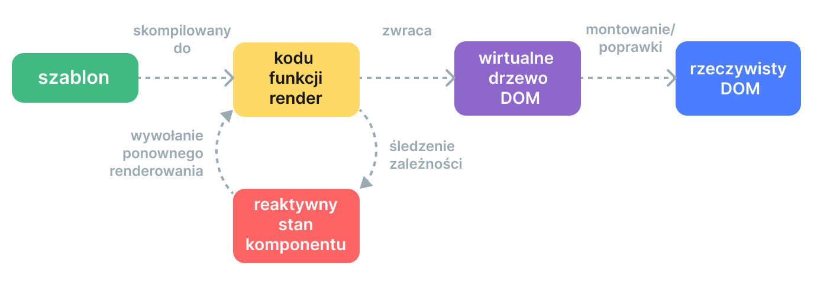

# Mechanizm renderowania {#rendering-mechanism}

Jak Vue przekształca szablon w rzeczywiste węzły DOM? Jak Vue efektywnie aktualizuje te węzły DOM? Postaramy się rzucić światło na te pytania, zagłębiając się w wewnętrzny mechanizm renderowania Vue.

## Wirtualny DOM {#virtual-dom}

Prawdopodobnie słyszałeś o terminie "wirtualny DOM", na którym opiera się system renderowania Vue.

Wirtualny DOM (VDOM) to koncepcja programistyczna, w której idealne lub "wirtualne" przedstawienie interfejsu użytkownika jest przechowywane w pamięci i synchronizowane z "rzeczywistym" DOM. Koncepcja została zapoczątkowana przez [React](https://reactjs.org/) i została przyjęta w wielu innych frameworkach z różnymi implementacjami, w tym Vue.

Wirtualny DOM to bardziej wzorzec niż konkretna technologia, więc nie ma jednej kanonicznej implementacji. Możemy zilustrować tę ideę prostym przykładem:

```js
const vnode = {
  type: 'div',
  props: {
    id: 'hello'
  },
  children: [
    /* więcej vnodes */
  ]
}
```

Tutaj `vnode` jest zwykłym obiektem JavaScript (węzłem "wirtualnym") reprezentującym element `<div>`. Zawiera wszystkie informacje potrzebne do utworzenia rzeczywistego elementu. Zawiera również więcej węzłów vnode potomnych, co czyni go korzeniem drzewa wirtualnego DOM.

Renderer środowiska wykonawczego może przejść przez drzewo wirtualnego DOM i zbudować z niego rzeczywiste drzewo DOM. Ten proces nazywa się **montowaniem**.

Jeśli mamy dwie kopie drzew wirtualnego DOM, renderer może również przejść i porównać oba drzewa, ustalając różnice i zastosować te zmiany do rzeczywistego DOM. Ten proces nazywa się **łataniem**, znany również jako "diffing" lub "uzgadnianie".

Główną zaletą wirtualnego DOM jest to, że daje programiście możliwość programowego tworzenia, sprawdzania i komponowania pożądanych struktur UI w sposób deklaratywny, pozostawiając bezpośrednią manipulację DOM rendererowi.

## Potok renderowania {#render-pipeline}

Na wysokim poziomie, oto co dzieje się, gdy komponent Vue jest montowany:

1. **Kompilacja**: Szablony Vue są kompilowane do **funkcji renderujących**: funkcji, które zwracają drzewa wirtualnego DOM. Ten krok może być wykonany albo z wyprzedzeniem poprzez etap budowania, albo w locie przy użyciu kompilatora środowiska wykonawczego.

2. **Montowanie**: Renderer środowiska wykonawczego wywołuje funkcje renderujące, przechodzi przez zwrócone drzewo wirtualnego DOM i tworzy na jego podstawie rzeczywiste węzły DOM. Ten krok jest wykonywany jako [efekt reaktywny](./reactivity-in-depth), więc śledzi wszystkie reaktywne zależności, które zostały użyte.

3. **Łatanie**: Gdy zależność używana podczas montowania zmienia się, efekt uruchamia się ponownie. Tym razem tworzone jest nowe, zaktualizowane drzewo wirtualnego DOM. Renderer środowiska wykonawczego przechodzi przez nowe drzewo, porównuje je ze starym i stosuje niezbędne aktualizacje do rzeczywistego DOM.



<!-- https://www.figma.com/design/CxGRAVJPCNyM1sIiqgG9bv/Rendering-Mechanism-(Copy)?node-id=0-1&m=dev&t=40t43kW6GKKSxrF2-1 -->

## Szablony vs. funkcje renderujące {#templates-vs-render-functions}

Szablony Vue są kompilowane do funkcji renderujących wirtualny DOM. Vue udostępnia również API, które pozwalają nam pominąć etap kompilacji szablonu i bezpośrednio tworzyć funkcje renderujące. Funkcje renderujące są bardziej elastyczne niż szablony podczas pracy z wysoce dynamiczną logiką, ponieważ możesz pracować z vnodami używając pełnej mocy JavaScript.

Dlaczego więc Vue domyślnie zaleca szablony? Jest kilka powodów:

1. Szablony są bliższe rzeczywistemu HTML. Ułatwia to ponowne wykorzystanie istniejących fragmentów HTML, stosowanie najlepszych praktyk dostępności, stylizowanie za pomocą CSS oraz zrozumienie i modyfikowanie przez projektantów.

2. Szablony są łatwiejsze do statycznej analizy ze względu na ich bardziej deterministyczną składnię. Pozwala to kompilatorowi szablonów Vue na zastosowanie wielu optymalizacji czasu kompilacji w celu poprawy wydajności wirtualnego DOM (o czym porozmawiamy poniżej).

W praktyce szablony są wystarczające dla większości przypadków użycia w aplikacjach. Funkcje renderujące są zazwyczaj używane tylko w komponentach wielokrotnego użytku, które muszą radzić sobie z wysoce dynamiczną logiką renderowania. Użycie funkcji renderujących jest szczegółowo omówione w [Funkcje Renderujące i JSX](./render-function).

## Wirtualny DOM wspomagany przez kompilator {#compiler-informed-virtual-dom}

Implementacja wirtualnego DOM w React i większości innych implementacji wirtualnego DOM jest czysto środowiskowa: algorytm uzgadniania nie może robić żadnych założeń co do przychodzącego drzewa wirtualnego DOM, więc musi w pełni przejść przez drzewo i porównać właściwości każdego vnode, aby zapewnić poprawność. Ponadto, nawet jeśli część drzewa nigdy się nie zmienia, nowe vnody są zawsze tworzone dla nich przy każdym ponownym renderowaniu, co skutkuje niepotrzebnym obciążeniem pamięci. Jest to jeden z najbardziej krytykowanych aspektów wirtualnego DOM: nieco brutalny proces uzgadniania poświęca wydajność na rzecz deklaratywności i poprawności.

Ale nie musi tak być. W Vue framework kontroluje zarówno kompilator, jak i środowisko wykonawcze. Pozwala nam to na implementację wielu optymalizacji czasu kompilacji, które może wykorzystać tylko ściśle powiązany renderer. Kompilator może statycznie analizować szablon i pozostawiać wskazówki w wygenerowanym kodzie, dzięki czemu środowisko wykonawcze może korzystać ze skrótów, gdy tylko jest to możliwe. Jednocześnie zachowujemy możliwość przejścia do warstwy funkcji renderującej dla bardziej bezpośredniej kontroli w przypadkach brzegowych. Nazywamy to hybrydowe podejście **Wirtualnym DOM Wspomaganym Przez Kompilator**.

Poniżej omówimy kilka głównych optymalizacji wykonywanych przez kompilator szablonów Vue w celu poprawy wydajności wirtualnego DOM w czasie wykonywania.

### Wynoszenie statyczne {#static-hoisting}

Dość często w szablonie będą części, które nie zawierają żadnych dynamicznych wiązań:

```vue-html{2-3}
<div>
 <div>foo</div> <!-- przeniesiony -->
 <div>bar</div> <!-- przeniesiony -->
 <div>{{ dynamic }}</div>
</div>
```

[Sprawdź w Eksploratorze Szablonów](https://template-explorer.vuejs.org/#eyJzcmMiOiI8ZGl2PlxuICA8ZGl2PmZvbzwvZGl2PiA8IS0tIGhvaXN0ZWQgLS0+XG4gIDxkaXY+YmFyPC9kaXY+IDwhLS0gaG9pc3RlZCAtLT5cbiAgPGRpdj57eyBkeW5hbWljIH19PC9kaXY+XG48L2Rpdj5cbiIsIm9wdGlvbnMiOnsiaG9pc3RTdGF0aWMiOnRydWV9fQ==)

Divy `foo` i `bar` są statyczne - ponowne tworzenie vnodów i porównywanie ich przy każdym ponownym renderowaniu jest niepotrzebne. Kompilator Vue automatycznie wynosi ich wywołania tworzenia vnode poza funkcję renderującą i ponownie wykorzystuje te same vnody przy każdym renderowaniu. Renderer jest również w stanie całkowicie pominąć ich porównywanie, gdy zauważy, że stary vnode i nowy vnode są tym samym.

Ponadto, gdy jest wystarczająco dużo kolejnych elementów statycznych, zostaną one skondensowane w jeden "statyczny vnode", który zawiera zwykły ciąg HTML dla wszystkich tych węzłów ([Przykład](https://template-explorer.vuejs.org/#eyJzcmMiOiI8ZGl2PlxuICA8ZGl2IGNsYXNzPVwiZm9vXCI+Zm9vPC9kaXY+XG4gIDxkaXYgY2xhc3M9XCJmb29cIj5mb288L2Rpdj5cbiAgPGRpdiBjbGFzcz1cImZvb1wiPmZvbzwvZGl2PlxuICA8ZGl2IGNsYXNzPVwiZm9vXCI+Zm9vPC9kaXY+XG4gIDxkaXYgY2xhc3M9XCJmb29cIj5mb288L2Rpdj5cbiAgPGRpdj57eyBkeW5hbWljIH19PC9kaXY+XG48L2Rpdj4iLCJzc3IiOmZhbHNlLCJvcHRpb25zIjp7ImhvaXN0U3RhdGljIjp0cnVlfX0=)). Te statyczne vnody są montowane przez bezpośrednie ustawienie `innerHTML`. Przechowują one również w pamięci podręcznej swoje odpowiednie węzły DOM przy początkowym montowaniu - jeśli ta sama treść jest ponownie wykorzystywana w innym miejscu aplikacji, nowe węzły DOM są tworzone przy użyciu natywnego `cloneNode()`, co jest niezwykle wydajne.

### Flagi łatania {#patch-flags}

Dla pojedynczego elementu z dynamicznymi wiązaniami możemy również wywnioskować wiele informacji o nim w czasie kompilacji:

```vue-html
<!-- wiązanie tylko klasy -->
<div :class="{ active }"></div>

<!-- wiązanie tylko id i value -->
<input :id="id" :value="value">

<!-- tylko tekst w dziecku -->
<div>{{ dynamic }}</div>
```

[Sprawdź w Eksploratorze Szablonów](https://template-explorer.vuejs.org/#eyJzcmMiOiI8ZGl2IDpjbGFzcz1cInsgYWN0aXZlIH1cIj48L2Rpdj5cblxuPGlucHV0IDppZD1cImlkXCIgOnZhbHVlPVwidmFsdWVcIj5cblxuPGRpdj57eyBkeW5hbWljIH19PC9kaXY+Iiwib3B0aW9ucyI6e319)

Podczas generowania kodu funkcji renderującej dla tych elementów, Vue koduje typ aktualizacji, którego każdy z nich potrzebuje, bezpośrednio w wywołaniu tworzenia vnode:

```js{3}
createElementVNode("div", {
  class: _normalizeClass({ active: _ctx.active })
}, null, 2 /* CLASS */)
```

Ostatni argument, `2`, jest [flagą łatania](https://github.com/vuejs/core/blob/main/packages/shared/src/patchFlags.ts). Element może mieć wiele flag łatania, które zostaną połączone w jedną liczbę. Renderer środowiska wykonawczego może następnie sprawdzić flagi za pomocą [operacji bitowych](https://en.wikipedia.org/wiki/Bitwise_operation), aby określić, czy musi wykonać określone zadania:

```js
if (vnode.patchFlag & PatchFlags.CLASS /* 2 */) {
  // aktualizuj klasę elementu
}
```

Sprawdzenia bitowe są niezwykle szybkie. Dzięki flagom łatania, Vue jest w stanie wykonać minimalną ilość pracy niezbędną podczas aktualizacji elementów z dynamicznymi powiązaniami.

Vue koduje również typ potomków, które posiada vnode. Na przykład, szablon który ma wiele węzłów głównych jest reprezentowany jako fragment. W większości przypadków mamy pewność, że kolejność tych węzłów głównych nigdy się nie zmieni, więc ta informacja może zostać również przekazana do runtime'u jako flaga łatania:

```js{4}
export function render() {
  return (_openBlock(), _createElementBlock(_Fragment, null, [
    /* children */
  ], 64 /* STABLE_FRAGMENT */))
}
```

Runtime może więc całkowicie pominąć uzgadnianie kolejności potomków dla fragmentu głównego.

### Spłaszczanie drzewa {#tree-flattening}

Przyglądając się ponownie wygenerowanemu kodowi z poprzedniego przykładu, zauważysz, że korzeń zwracanego wirtualnego drzewa DOM jest tworzony przy użyciu specjalnego wywołania `createElementBlock()`:

```js{2}
export function render() {
  return (_openBlock(), _createElementBlock(_Fragment, null, [
    /* children */
  ], 64 /* STABLE_FRAGMENT */))
}
```

Koncepcyjnie, "blok" jest częścią szablonu, która ma stabilną wewnętrzną strukturę. W tym przypadku, cały szablon ma pojedynczy blok, ponieważ nie zawiera żadnych dyrektyw strukturalnych takich jak `v-if` i `v-for`.

Każdy blok śledzi wszystkie węzły potomne (nie tylko bezpośrednie potomki), które mają flagi łatania. Na przykład:

```vue-html{3,5}
<div> <!-- blok główny -->
  <div>...</div>         <!-- nieśledzony -->
  <div :id="id"></div>   <!-- śledzony -->
  <div>                  <!-- nieśledzony -->
    <div>{{ bar }}</div> <!-- śledzony -->
  </div>
</div>
```

Rezultatem jest spłaszczona tablica, która zawiera tylko dynamiczne węzły potomne:

```
div (blok główny)
- div z wiązaniem :id
- div z wiązaniem {{ bar }}
```

Kiedy ten komponent musi się przerenderować, musi przejść tylko przez spłaszczone drzewo zamiast pełnego drzewa. Jest to nazywane **Spłaszczaniem Drzewa**, i znacznie redukuje liczbę węzłów, które muszą zostać przeanalizowane podczas uzgadniania wirtualnego DOM-u. Wszystkie statyczne części szablonu są efektywnie pomijane.

Dyrektywy `v-if` i `v-for` utworzą nowe węzły blokowe:

```vue-html
<div> <!-- blok główny -->
  <div>
    <div v-if> <!-- blok if -->
      ...
    </div>
  </div>
</div>
```

Blok potomny jest śledzony wewnątrz tablicy dynamicznych potomków bloku nadrzędnego. Zachowuje to stabilną strukturę dla bloku nadrzędnego.

### Wpływ na hydrację SSR {#impact-on-ssr-hydration}

Zarówno flagi łatania jak i spłaszczanie drzewa znacznie poprawiają wydajność [Hydracji SSR](/guide/scaling-up/ssr#client-hydration) Vue:

- Hydracja pojedynczego elementu może wykorzystywać szybkie ścieżki na podstawie odpowiadającej flagi łatania vnode.

- Tylko węzły blokowe i ich dynamiczni potomkowie muszą zostać przeanalizowani podczas hydracji, efektywnie osiągając częściową hydrację na poziomie szablonu.
